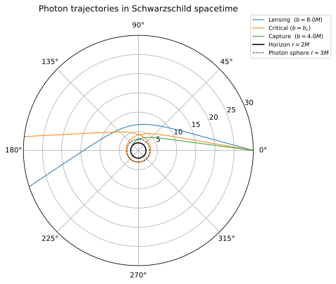
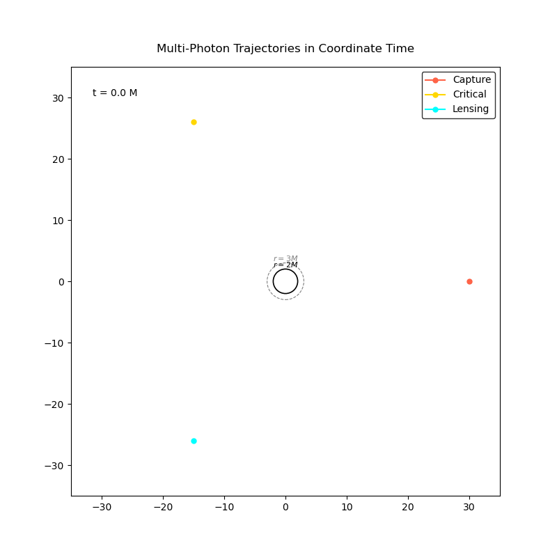

# Photon Trajectories and Optical Phenomena in Schwarzschild Spacetime

Hi! This repo holds the numerical simulation I built during my research internship
at the International Centre for Space and Cosmology (ICSC), Ahmedabad University,
under Dr. Pankaj Joshi. It integrates the null geodesic equations for photons
around a Schwarzschild black hole from first principles — no pre-packaged GR
libraries — using only NumPy, SciPy, and Matplotlib.

The simulation covers:

- **Theoretical setup**
  * Null geodesic derivation from the Schwarzschild metric
  * Conserved quantities (E, L) from Killing vectors
  * Effective potential and the photon sphere at r = 3M
- **Trajectory classification**
  * Gravitational lensing (b > b_c)
  * Photon capture (b < b_c)
  * Critical winding orbits near b_c = 3√3 M
- **Deflection angle**
  * Numerical extraction vs. the weak-field result Δφ ≈ 4M/b
- **Gravitational time dilation**
  * Reparameterizing trajectories onto coordinate time t, animated, so photons
    visibly freeze near the event horizon as seen by a distant observer

Full derivations and discussion are in `report/`.

## Contents and Repository Structure

```
photon-trajectories/
├── physics.py                    # shared ODE system, integrator, constants
├── 01_effective_potential.py     # effective potential vs Newtonian comparison
├── 02_polar_trajectories.py      # polar plot: lensing / critical / capture
├── 03_deflection_angle.py        # deflection angle: numerical vs weak-field
├── 04_lensing_animation.py       # coordinate-time animation, time dilation
├── report/                       # full internship report (.tex + .pdf)
├── figures/                      # rendered output (svg plots + gif)
├── pyproject.toml
└── uv.lock
```

## Requirements

- Python ≥ 3.10
- [`uv`](https://docs.astral.sh/uv/) (recommended) or `pip`

## Setup

Using `uv` (recommended):

```bash
git clone https://github.com/adi-pandya/photon-trajectories.git
cd photon-trajectories
uv sync
```

Using `pip`:

```bash
git clone https://github.com/adi-pandya/photon-trajectories.git
cd photon-trajectories
python -m venv .venv
source .venv/bin/activate
pip install -r requirements.txt
```

## Usage

Each figure script is standalone and imports shared physics from `physics.py`:

```bash
uv run 01_effective_potential.py
uv run 02_polar_trajectories.py
uv run 03_deflection_angle.py
uv run 04_lensing_animation.py
```

Each run prints a null-invariant drift check (should stay ~1e-9 or smaller) and
saves its plot as an `.svg` in the working directory.

## Results

**Photon trajectories** — lensing, critical, and capture cases around the photon sphere:



**Gravitational time dilation** — captured photon visibly slows near the horizon:



## Physics context

This project connects to Dr. Joshi's broader research on gravitational collapse
and naked singularities — the boundary at b_c that separates capture from escape
is exactly what determines a black hole's observed shadow, as imaged by the Event
Horizon Telescope. Natural extensions (Kerr geodesics, full image-plane ray-tracing,
black hole vs. naked singularity shadow comparison) are discussed in the report's
conclusion.

Thanks for visiting this repository!
